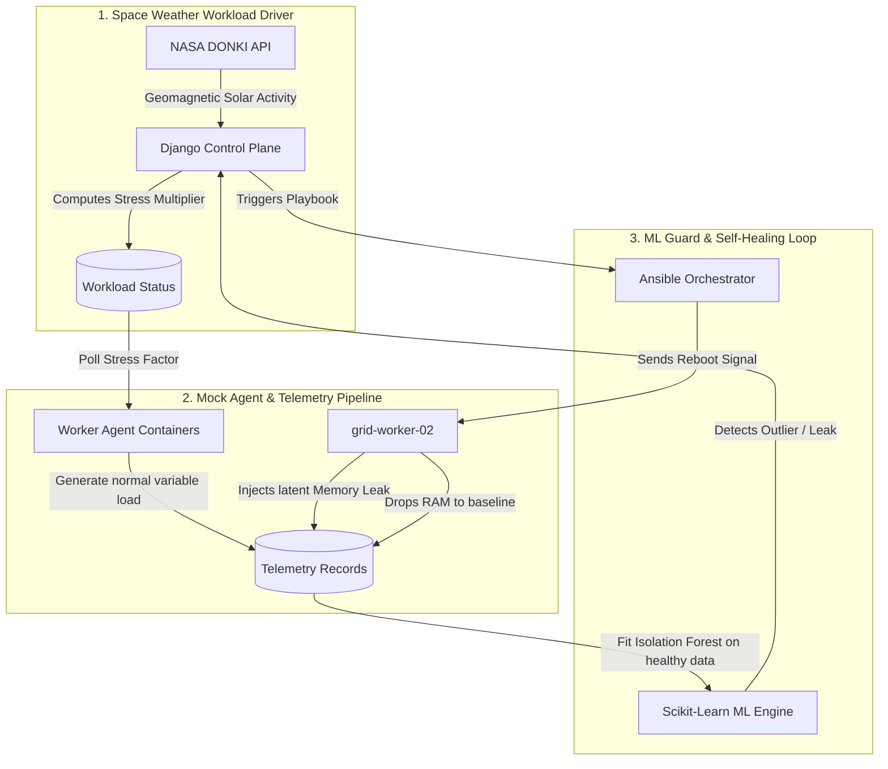

# SciOps Grid Sentinel 🛡️

SciOps Grid Sentinel is a production-grade, containerized **Self-Healing Observability Console and Orchestration Pipeline** designed for distributed high-performance grid environments (such as the Worldwide LHC Computing Grid - WLCG).

It demonstrates how modern DevOps practices (Infrastructure-as-Code, configuration management, and automation playbooks) can be combined with unsupervised machine learning to detect and remediate latent infrastructure anomalies automatically. It now includes Kubernetes-style horizontal autoscaling and telemetry normalization to avoid catastrophic cascading grid failures under high space weather loads.

---

## 🌟 Functional Overview: How It Works

To demonstrate real-time cluster behavior without static placeholders, the system coordinates three parallel loops:



### 1. Why Telemetry Metrics Vary (The NASA Space Weather Driver)
The control plane queries **NASA's Space Weather Database (DONKI)** to detect geomagnetic solar storms (falling back to a solar cycle simulation if the API key is offline). 
*   Heavy solar activity increases the geomagnetic index (**Kp-Index**) and **solar wind speed**.
*   The control plane translates this into a cluster **Stress Multiplier** (e.g., `1.0x` to `3.0x`).
*   Worker agents query this stress factor every 5 seconds, scaling their simulated **CPU load, active job counts, and network traffic** to mirror real scientific data processing runs during solar storms.

### 2. Kubernetes-Style Horizontal Autoscaling (HPA) & Load Balancing
To handle solar storm workload surges and avoid catastrophic cascading grid failures, the system features a Kubernetes-style Horizontal Pod Autoscaler:
*   **Dynamic Scaling**: The Control Plane monitors the environmental stress multiplier. When it spikes (stress_multiplier > 1.2), the system dynamically provisions and registers virtual worker nodes (`grid-worker-03` to `grid-worker-06`) to share the load.
*   **Load Balancing**: Worker agents query the active worker count from the control plane and dynamically scale down their CPU, network, and active job load by `(2 / active_workers)`. This balances the processing load across all active workers, preventing healthy nodes from overloading.
*   **Scale-Down**: When space weather calms down, the autoscaler automatically de-provisions the extra virtual workers, gracefully returning the cluster to its baseline configuration.

### 3. Telemetry Normalization (SRE ML Safeguards)
During solar storms, resource usage (CPU, Network, Jobs) rises naturally across all workers. If sent unmodified to the unsupervised Isolation Forest model, these peaks would be flagged as anomalies, triggering catastrophic false-positive container reboots.
*   **Normalization**: Telemetry metrics are normalized by dividing CPU usage, network activity, and jobs by the current `stress_multiplier` prior to anomaly classification and model training.
*   **Outcome**: The ML model learns that high load during space weather events is expected (inlier) behavior. The system remains fully resilient against solar storms, while still isolating and remediating localized issues like the latent memory leak on `grid-worker-02`.

### 4. The Anomaly Simulation (Latent Memory Leak)
To test the self-healing capability, the `grid-worker-02` agent container has a latent anomaly scheduler:
*   After 10 check-in loops, the agent develops a **memory leak**.
*   Its RAM consumption begins climbing linearly by **+4.5% per loop** up to a maximum of `98.5%`.
*   This represents a slow-burning leak that can easily slip past simple, static alert limits in its early stages.

### 5. The ML Training Engine (Isolation Forest Outlier Detection)
Every time a worker node posts telemetry, the Django control plane processes the data using a `scikit-learn` **Isolation Forest** model:
*   **Unsupervised Learning:** The model does not require pre-labeled anomaly datasets. It trains on a sliding window of the node's last 200 normal check-ins (`is_anomaly=False`), learning its unique baseline performance profile.
*   **Isolating Outliers:** The algorithm works by randomly splitting data points. Anomalous values (like the memory leak) are isolated near the root of the trees (requiring very few splits), returning a prediction of `-1`.
*   **Dynamic Exclusion:** Once a metric is flagged as anomalous, its `is_anomaly` database flag is set to `True`, automatically excluding it from future training sets to prevent training set pollution (concept drift).

### 6. SRE Defense-in-Depth Fail-Safe
In alignment with production Site Reliability Engineering (SRE) standards, the ML model is backed by deterministic threshold guardrails. If a node's CPU exceeds `95%` or RAM exceeds `90%`, it is unconditionally marked `Degraded` to prevent slow-drift escape.

### 7. Automated Ansible Recovery Loop
*   Once an anomaly is flagged, Django changes the node's status to `Degraded` and starts a background thread simulating an **Ansible recovery playbook** (`recover_node.yml`).
*   The node transitions to `Recovering`. During this state, the control plane returns a `reboot: True` flag in the webhook response.
*   The worker agent receives the signal, resets its leak flags, drains its compute jobs, and drops its RAM consumption back down to baseline (~40%).
*   The recovery thread completes, marking the node `Healthy` on the dashboard.

---

## 🛠️ Technology Stack & Architecture

*   **Django Control Plane:** Python 3.11 web service exposing the live dashboard, Puppet External Node Classifier (ENC) endpoint, and metrics ingestion webhooks.
*   **Scikit-Learn:** Orchestrates the Isolation Forest machine learning anomaly detector.
*   **Docker Compose:** Orchestrates containerized PostgreSQL, Redis, Django, and mock worker agents.
*   **Puppet ENC Endpoint:** Simulates dynamic configuration classification (`/api/enc/<hostname>/`) returning YAML profiles for node role assignments.
*   **Ansible:** Automation playbooks triggered asynchronously to orchestrate node restarts.

---

## 📁 Directory Structure

```text
grid-sentinel/
├── README.md               # Functional and technical architectural documentation
├── docker-compose.yml      # Multi-container cluster configuration
├── Jenkinsfile             # CI/CD multi-stage linting & testing pipeline
├── terraform/
│   └── main.tf             # Terraform mapping grid container topologies
├── ansible/
│   ├── playbooks/
│   │   └── recover_node.yml # Remediation playbook to reboot containers
│   └── ansible.cfg
├── puppet/
│   └── manifests/
│       └── site.pp         # Puppet classifier manifest entrypoint
└── django_control_plane/   # Core Django Web Service
    ├── manage.py
    ├── config/             # Root settings and routing
    ├── nodes/              # Core cluster logic
    │   ├── models.py       # DB schemas for Telemetry, Nodes, and Events
    │   ├── views.py        # Dashboard rendering and REST endpoints
    │   ├── ml_engine.py    # Scikit-learn Isolation Forest logic
    │   └── tasks.py        # NASA DONKI API integration task
    └── templates/
        └── dashboard.html  # Responsive glassmorphic monitoring dashboard
```

---

## 🚀 Quick Start & Operations

### Prerequisites
*   Docker & Docker Compose

### 1. Launch the Cluster
Start the cluster services (Database, Cache, Django, and Worker Agents):
```bash
make up
```

### 2. Initialize database schemas
Run the Django migrations to create the database tables:
```bash
make migrate
```

### 3. Open the Console
Access the dashboard at [http://localhost:8000/](http://localhost:8000/) to watch the live metrics visualization and real-time operations event stream.
